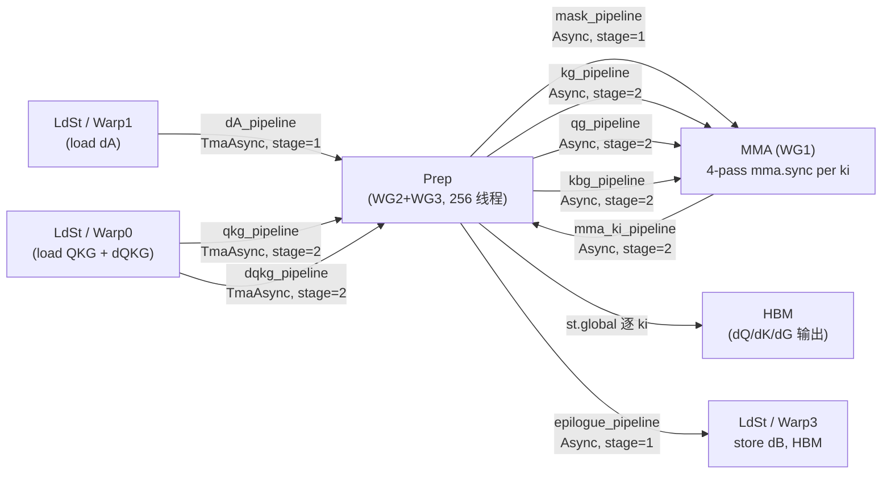
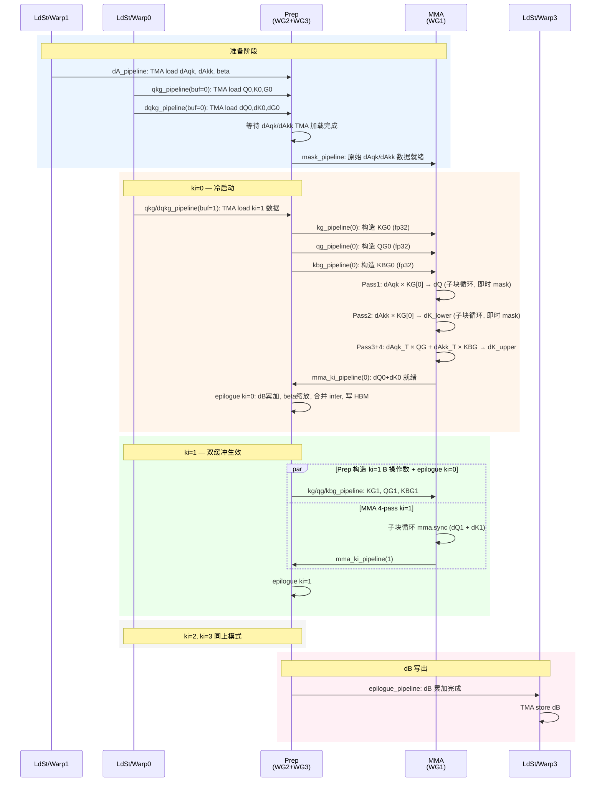

# [Review] SM90 KDA Backward Intra-Chunk Kernel 设计方案

> **状态**：v3 — mma.sync 首选 + Sub-Chunk 子块循环 + per-subchunk G_norm
> **作者**：zheyang
> **参考实现**：SM100 `kda_bwd_intra_sm100.cu` + SM90 forward `kernel_kda_fwd.hpp`
> **详细设计**：《Hopper (SM90) KDA Backward Intra-Chunk Kernel 设计文档》

---

## 1. 背景

| 架构 | Forward | Backward |
|------|---------|----------|
| Triton | 已有 | 已有 |
| SM100 (Blackwell) CUDA | 已有 | 已有 |
| **SM90 (Hopper) CUDA** | **已有** | **缺失** |

目标：实现 SM90 上的 `kda_bwd_intra` kernel —— KDA backward 6 个 kernel 中的最后一步（K6），在 K5 算好的 inter-chunk 梯度上累加 chunk 内梯度，输出最终的 dQ、dK、dBeta、dG。

设计策略：**数学对齐 SM100 参考实现**。

---

## 2. 核心计算（4-pass mma.sync 子块循环）

> **v3 关键变化**：从 WGMMA 整块 64×64 方案改为 SM80 mma.sync 子块循环（M=16 天然匹配 16-token 子块），每个子块独立 G_norm，与 Triton 精度完全对齐。A 操作数通过寄存器加载时即时 mask，无需预构造 masked dA 矩阵。

### 2.1 为什么不能融合 dAqk 和 dAkk

参考 Triton 代码和 SM100 实现，原因有三：

1. **dQ 只使用 dAqk**：`b_dq2 += tl.dot(b_dAqk, b_kg)`，dAkk 不参与 dQ 计算
2. **dK 的两个来源需要不同 B 操作数**：
   - `b_dkt += tl.dot(b_dAqk, b_qg)` — B 操作数是 QG
   - `b_dkt += tl.dot(b_dAkk, b_kbg)` — B 操作数是 KBG（含 beta）
3. **SM100 也不做加法融合**：`setup_qkg_intra` 将 QG 和 KBG 存储在不同偏移量（offset 0 和 +16）

### 2.2 正确的 4-pass 方案

每个 ki 迭代的 4 趟 MMA。mma.sync 按子块循环执行（每个子块 M=16），每个子块使用独立的 $G_n$：

**KG 阶段**（使用 KG 作为 B 操作数，B 为 fp32 存储、硬件截断 TF32）：

| Pass | A 操作数 (SMEM→寄存器, fp32/TF32) | B 操作数 (SMEM→寄存器, fp32/TF32) | 输出 (寄存器 fragment) | 说明 |
|------|-------------------------------|-------------------------------|---------------------|------|
| 1 | dAqk 子块 [16,16]（即时 mask，$j_s \le i_s$） | KG 子块 [16,32] | → dQ [16,32] 逐子块累加 | dQ 只来自 dAqk |
| 2 | dAkk 子块 [16,16]（即时 mask，$j_s < i_s$） | KG 子块 [16,32] | → dK_lower [16,32] 逐子块累加 | dK 下三角贡献 |

**QKG 阶段**（使用 QG / KBG 作为 B 操作数）：

| Pass | A 操作数 (SMEM→寄存器, fp32/TF32) | B 操作数 (SMEM→寄存器, fp32/TF32) | 输出 (寄存器 fragment) | 说明 |
|------|-------------------------------|-------------------------------|---------------------|------|
| 3 | dAqk 转置子块 [16,16]（即时 mask+转置，$i_s \ge j_s$） | QG 子块 [16,32] | → dK_upper_qk [16,32] 逐子块累加 | dK 上三角 qk 贡献 |
| 4 | dAkk 转置子块 [16,16]（即时 mask+转置，$i_s > j_s$） | KBG 子块 [16,32] | → dK_upper_kk [16,32] 逐子块累加 | dK 上三角 kk 贡献 |

> 每 ki 共 32 次 mma.sync 子块调用 × 4 ki = **128 次 mma.sync 指令**（详见 3.6 节 MMA 计数表）。

### 2.3 三种 B 操作数

$$KG[j, d] = K[j, d] \cdot \exp_2(G_n[d] - G[j, d])$$

$$QG[i, d] = Q[i, d] \cdot \exp_2(G[i, d] - G_n[d])$$

$$KBG[i, d] = K[i, d] \cdot \beta[i] \cdot \exp_2(G[i, d] - G_n[d])$$

> B 操作数以 **fp32** 存储在 SMEM，MMA 线程加载到寄存器后硬件截断为 TF32。注意 QG 和 KBG 的 gate 方向（G - Gn）与 KG（Gn - G）相反。

### 2.4 A 操作数：即时 mask

mma.sync 通过寄存器加载 A 操作数，可在加载 16×16 子块时**即时应用 causal mask**，无需预构造 masked 矩阵：

- **Pass 1 (dQ)**：加载 `dAqk[is*16:(is+1)*16, js*16:(js+1)*16]`，$j_s \le i_s$ 有效；$j_s = i_s$ 时对角线 mask（$j \le i$）；$j_s > i_s$ 跳过
- **Pass 2 (dK_lower)**：加载 `dAkk[is*16:(is+1)*16, js*16:(js+1)*16]`，$j_s < i_s$ 有效；$j_s = i_s$ 对角线 mask（$j < i$，严格下三角）；$j_s \ge i_s$ 跳过
- **Pass 3 (dK_upper_qk)**：加载 `dAqk[is*16:(is+1)*16, js*16:(js+1)*16]`，即时转置为 `[js, is]` 子块，$i_s \ge j_s$ 有效
- **Pass 4 (dK_upper_kk)**：加载 `dAkk[is*16:(is+1)*16, js*16:(js+1)*16]`，即时转置，$i_s > j_s$ 有效

> **对比 WGMMA**：WGMMA SS 模式 A 操作数直接从 SMEM 读取，必须预先 mask 好（需要 4 个 64×64 fp32 矩阵 = 64KB）。mma.sync 即时 mask 节省这 64KB SMEM。

### 2.5 Epilogue 中 dK 的组合与 dB 的计算

> **v3 关键变化**：采用 per-subchunk G_norm + 子块 MMA 循环后，gate scale 已在 MMA 的子块循环内逐次累加完成。MMA fragment 写出时**已包含正确的 gate scale**，Prep epilogue 不再需要额外乘 `exp2(G - Gn)`。

Pass 2 产出 dK_lower（dAkk 下三角 × KG，已含 gate scale），epilogue 处理顺序：

```
1. dB[i] += Σ_d dK_lower[i,d] × K[i,d]     ← dB 在 beta 缩放之前（dK_lower 已含 gate scale）
2. dK_lower_final = dK_lower × beta[i]       ← beta 缩放（beta 不在 gate 里）
3. dK_final = dK_inter + dK_lower_final + dK_upper  ← dK_upper = Pass 3 + Pass 4，也已含 gate scale
```

### 2.6 完整公式

> **v3 更新**：采用 per-subchunk G_norm 后，gate scale 在子块 MMA 循环内逐次累加完成。以下公式展示最终等价的数学结果。

$$dQ[i,d] = \sum_{j_s=0}^{3} \exp_2(\min(G[i,d] - G_{n,j_s}[d], 0)) \cdot \sum_{j \in \text{sub-tile } j_s} dA_{qk}[i,j] \cdot K[j,d] \cdot \exp_2(G_{n,j_s}[d] - G[j,d])$$

对有效 $(i,j)$ 对（$j \le i$），$\min$ 退化为等号，两个 $G_n$ 抵消，等价于 $\exp_2(G[i,d] - G[j,d])$。

$$dK[i,d] = dK_{\text{inter}} + \underbrace{\beta[i] \cdot dK\_lower[i,d]}_{\text{下三角 (Pass 2, 已含 gate scale)}} + \underbrace{dK\_upper[i,d]}_{\text{上三角 (Pass 3+4, 已含 gate scale)}}$$

---

## 3. Sub-Chunk 与因果 Mask 策略

### 3.1 Sub-Chunk 的本质

完整公式 $dQ[i,d] = \sum_{j \le i}(\ldots)$ 是因果下三角求和。64 个 token 分成 4 个子块（BC=16）：

```
         j_s=0    j_s=1    j_s=2    j_s=3
i_s=0  [ 对角块 |  全零   |  全零   |  全零  ]
i_s=1  [ 全满   | 对角块  |  全零   |  全零  ]
i_s=2  [ 全满   |  全满   | 对角块  |  全零  ]
i_s=3  [ 全满   |  全满   |  全满   | 对角块 ]
```

- **全满块**（$j_s < i_s$）：16×16 所有元素有效
- **对角块**（$j_s = i_s$）：需因果 mask（j ≤ i）
- **全零块**（$j_s > i_s$）：全部为零，**可直接跳过**

### 3.2 Triton vs SM90 CUDA 的处理方式

| | Triton（子块循环） | SM90 mma.sync（子块循环） | WGMMA 备选（整块 + 在线重缩放） |
|---|---|---|---|
| 循环方式 | $i_s$ 次 `tl.dot`（每个子块一次） | 逐子块 mma.sync（M=16 天然匹配） | 整块 64×64 WGMMA + 在线重缩放 |
| mask 处理 | 只对对角块做 mask | 即时 mask（寄存器加载时判断） | Prep 预构造 4 个 masked dA |
| 零块处理 | 跳过 | **跳过**（$j_s > i_s$ 短路） | 浪费（上三角零元素仍参与乘法） |
| G_norm | 每个子块选不同参考点 | **每个子块独立 G_norm**（完全一致） | 在线重缩放对齐参考点 |
| SMEM 额外开销 | — | 0 | +64KB masked dA + 384B rescale |

### 3.3 SM90 的选择：mma.sync 子块循环

SM80 `mma.sync.m16n8k8` 的 M=16 天然匹配 16-token 子块，可以像 Triton 一样逐子块做矩阵乘法：

> **MMA 线程从 SMEM 加载 16×16 dA 子块到寄存器时即时判断子块关系：$j_s < i_s$ 全块有效；$j_s = i_s$ 对角线 mask（$j \le i$）；$j_s > i_s$ 全零跳过。**

**为什么不用 WGMMA 整块方案？** WGMMA 最小 M=64，无法直接做 16×16 子块 MMA，必须在 64×64 整块上做 + 在线重缩放对齐参考点。这增加了实现复杂度（rescale 逻辑）和 SMEM 开销（+64KB 预构造 masked dA）。而 mma.sync 子块循环与 Triton 完全一致，实现简单，精度对齐，且 forward 的 `compute_aux_safe()` 已验证过此方案。

### 3.4 Prep 的职责（mma.sync 方案）

mma.sync 方案下，Prep **不需要预构造 masked dA 矩阵**。Prep 的职责简化为：

1. **等待 dAqk/dAkk TMA 加载完成**，通知 MMA 原始数据就绪
2. **构造 B 操作数**（KG / QG / KBG），每个子块使用独立 G_norm
3. **逐 ki epilogue**：合并 MMA 产出的 intra 梯度与 inter-chunk 输入，计算 dB/dG，写 HBM

```cpp
// Prep 核心流程（mma.sync 方案）
tid = threadIdx.x - 256;  // Prep 内线程 ID [0, 255]

// 等待 dAqk/dAkk TMA 加载完成，通知 MMA 数据就绪（mma.sync 即时 mask，无需预构造）
// dA_pipeline.consumer_wait() → mask_pipeline.producer_commit()

// 构造 KG: fp32, 2048 元素 / 256 线程 = 8 元素/线程
for (int idx = tid; idx < 64 * K_TILE; idx += 256) {
    int j = idx / K_TILE, d = idx % K_TILE;
    float g_val = smem_g[buf][j * K_TILE + d];
    float k_val = smem_k[buf][j * K_TILE + d];
    smem_kg[buf][j * K_TILE + d] = k_val * exp2f(g_norm[d] - g_val);
    // fp32 存储, mma.sync 加载时硬件截断为 TF32
}
```

### 3.5 G_norm 参考点与数值稳定性

#### 问题：单一 G_norm 会导致硬溢出

v2 曾考虑整个 chunk 使用单一 $G_n = G[0, d]$（chunk 首 token），但这在数学上**不可行**——不是精度问题，而是**硬溢出（inf/NaN）**。

**溢出分析**：$G[t, d] = \sum_{s=0}^{t} \log_2(\alpha_s[d])$，其中 $\alpha \in [0,1]$，所以 $\log_2(\alpha) \le 0$，$G$ 单调递减。对于较小的 $\alpha$：

| $\alpha$ | $\log_2(\alpha)$ | $G[0] - G[63]$ | $\exp_2$ 结果 |
|---------|-----------------|----------------|-------------|
| 0.9 | -0.152 | 9.7 | 831 |
| 0.5 | -1.0 | 63 | $9.2 \times 10^{18}$ |
| 0.3 | -1.74 | 109 | **溢出**（fp32 最大指数 ~127） |
| 0.1 | -3.32 | 209 | **溢出** |

**结论**：只要 $\alpha$ 足够小，单一 G_norm 下 KG 侧的 $\exp_2(G_n[d] - G[j, d])$ **必然溢出为 inf**，导致结果为 NaN（IEEE 754 中 $0 \times \text{inf} = \text{NaN}$）。

#### 解决方案：Per-subchunk G_norm（与 Triton 完全一致）

**核心思想**：mma.sync M=16 天然匹配子块，每个 16-token 子块使用自己的 $G_n$，exp2 参数限制在安全范围内。

**Per-subchunk G_norm 的选择**（对齐 Triton 参考实现）：

| B 矩阵方向 | Sub-tile $j_s$ | $G_n$ | exp2 参数 | 安全性 |
|-----------|---------------|-------|----------|-------|
| KG（Pass 1, 2）| $j_s = 0..3$ | $G[j_s \times 16, d]$ | $G_n - G[j] \in [0, 16 \times |\log_2\alpha|]$ | 最大 ~53（$\alpha=0.1$），安全 |
| QG/KBG（Pass 3, 4）| $i_s = 0..3$ | $G[i_s \times 16, d]$ | $G[i] - G_n \in [16 \times \log_2\alpha, 0]$ | $\le 0$，$\exp_2 \le 1$，安全 |

**安全性证明**：

**KG 侧**（$\exp_2(G_n - G[j])$）：$G_n = G[j_s \times 16]$ 是子块首行，子块内 $j$ 范围是 $[j_s \times 16, (j_s+1) \times 16 - 1]$。因为 $G$ 单调递减，$G_n \ge G[j]$，参数非负。最大值出现在 $j = (j_s+1) \times 16 - 1$，为 $16 \times |\log_2\alpha|$。即使 $\alpha = 0.1$，最大参数也仅 $16 \times 3.32 = 53$，远小于 fp32 安全上限 127。

**Q/K-scale 侧**（在 fragment 上逐元素缩放）：

- 非转置 Pass（dQ, dK_lower）：scale = $\exp_2(\min(G[i] - G_n, 0))$。对有效行（$i \ge j_s \times 16$），参数 $\le 0$，$\exp_2 \le 1$。对无效行，dA 的因果 mask 已将对应列置零，$0 \times \text{finite} = 0$，正确。

- 转置 Pass（dK_upper）：scale = $\exp_2(\text{clamp}(G_n - G[j], -126, 126))$。对有效行，参数有界。对无效行，dA_T 的因果 mask 已置零，clamp 防止 inf。

### 3.6 Sub-tile MMA 循环（per-subchunk G_norm 实现）

#### 非转置 Pass（dQ: Pass 1, dK_lower: Pass 2）

以 Pass 1（dQ）为例，Pass 2（dK_lower）完全对称（使用 dAkk，$j_s < i_s$）：

```
// 每个输出子块 is 需要累加 js=0..is 的贡献
for (is = 0; is < 4; ++is):
    frag_dq_is = 0  // 16×32 fp32, 寄存器 fragment

    for (js = 0; js <= is; ++js):
        // ── MMA 线程从 SMEM 加载 16×16 dAqk 子块到寄存器 ──
        // is==js 时应用因果 mask (j ≤ i)，js<is 时整块有效
        // 取 B 操作数: KG_js[16, 32]，基于 G_norm_js = G[js×16, d]
        mma.sync: frag_tmp = dA_subblock × KG_js

        // ── 逐元素缩放：使用源子块的 G_norm_js（不是输出子块的 G_norm_is）──
        // 每个子块的 KG_js 基于 G_norm_js 构造，这里补乘 Q 侧对应的 scale
        q_scale[i, d] = exp2f(min(G[i, d] - G_norm_js[d], 0.0f))
        frag_dq_is += frag_tmp * q_scale

    写出 frag_dq_is → smem_dq_out[buf]（对应 is 子块的 16 行）
```

#### 转置 Pass（dK_upper: Pass 3+4）

```
// 每个输出子块 js 需要累加 is=js..3 (Pass 3) 和 is=js+1..3 (Pass 4) 的贡献
for (js = 0; js < 4; ++js):
    frag_dkt_js = 0  // 16×32 fp32

    for (is = js; is < 4; ++is):
        // Pass 3: 加载 dAqk[is,js] 子块，即时转置
        // Pass 4: 加载 dAkk[is,js] 子块，即时转置（is>js 有效）
        // 取 B 操作数: QG_is[16, 32] / KBG_is[16, 32]，基于 G_norm_is
        mma.sync: frag_tmp = dAqk_T_subblock × QG_is

        // ── 逐元素缩放：使用源子块的 G_norm_is（QG/KBG 基于 G_norm_is 构造）──
        k_scale[j, d] = exp2f(clamp(G_norm_is[d] - G[j, d], -126, 126))
        frag_dkt_js += frag_tmp * k_scale

        if (is > js):
            mma.sync: frag_tmp2 = dAkk_T_subblock × KBG_is
            frag_dkt_js += frag_tmp2 * k_scale  // 同一 G_norm_is，复用 k_scale

    写出 frag_dkt_js → smem_dkt_out[buf]（对应 js 子块的 16 行）
```

#### MMA 计数表

| Pass | 三角方向 | 子块循环 | 子块 MMA 调用数 |
|------|---------|---------|--------------|
| 1 (dQ) | 下三角含对角线 ($j_s \le i_s$) | `js=0..is` | 1+2+3+4 = **10** |
| 2 (dK_lower) | 严格下三角 ($j_s < i_s$) | `js=0..is-1` | 0+1+2+3 = **6** |
| 3 (dK_upper_qk) | 上三角含对角线转置 ($i_s \ge j_s$) | `is=js..3` | 4+3+2+1 = **10** |
| 4 (dK_upper_kk) | 严格上三角转置 ($i_s > j_s$) | `is=js+1..3` | 3+2+1+0 = **6** |
| **合计** | | | **32 次/ki** |

4 个 ki 总计 **128 次 mma.sync 调用**（每次处理 16×16 × 16×32 子块乘法，内部 K=16/8=2 iterations）。

#### Epilogue 简化

gate scale 在子块循环内逐次累加，MMA fragment 写出时已包含正确的 gate scale。Prep epilogue 简化为：

```
dQ_final  = dQ_inter + dQ_out                  // 不再需要 × exp2(G - Gn)
dK_lower_final = dK_lower × beta               // 仍需 beta 缩放（beta 不在 gate 里）
dK_final  = dK_inter + dK_lower_final + dK_upper  // 不再需要额外 gate scale
dB[i]    += Σ_d dK_lower[i,d] × K[i,d]         // dB 在 beta 缩放之前（dK_lower 已含 gate scale）
```

---

## 4. Warp Group 分工（核心决策）

512 线程 = 4 WG，采用 **1 MMA + 2 Prep** 方案：

```
WG0 (128线程) : LdSt   — TMA 加载 + 写回（4 warp 分工）
WG1 (128线程) : MMA    — mma.sync 串行执行 4 pass/ki（复用 fragment）
WG2 (128线程) : Prep   — 标量计算：等待 dA 就绪通知 MMA、gate 构造、dB/dG、逐 ki epilogue
WG3 (128线程) : Prep   — 与 WG2 按元素 ID 分工协作
```

### 决策依据

SM100 参考实现的线程分配：CE（标量计算）256 线程 / 67%，MMA 32 线程 / 8%。这说明**标量计算是瓶颈**。

| 方案 | MMA | Prep | 标量计算能力 vs SM100 |
|------|-----|------|--------------------|
| 2 MMA + 1 Prep | 256线程 (2WG) | 128线程 (1WG) | SM100 的 **50%** |
| **1 MMA + 2 Prep** | **128线程 (1WG)** | **256线程 (2WG)** | SM100 的 **100%** |

选择后者。代价是损失 WGMMA 流水线化发射的机会，但 mma.sync 是同步指令，本身不存在异步流水线化，因此无额外损失。

### 寄存器分配

```
LdSt: 24 reg/thread (dealloc)    MMA: 168 reg/thread (alloc)
Prep: 160 reg/thread × 2 WG (alloc)
验证: (24 + 168 + 160 + 160) × 128 = 65536 ✓
```

### LdSt Warp 内部分工

| Warp | 角色 | 职责 | 数据量 |
|------|------|------|--------|
| Warp 0 | **LoadQKG** | TMA 加载 Q, K, G + dQ, dK, dG 的 inter 输入（每 ki 双缓冲） | per-ki 6 tiles |
| Warp 1 | **LoadDA** | TMA 一次性加载 dAqk, dAkk, beta | 32KB + 128B |
| Warp 2 | **空闲/备用** | dQ/dK 由 Prep 逐 ki 直接 global store。备用：如 Prep global store 性能不佳可改为 TMA store | — |
| Warp 3 | **StoreMisc** | TMA 写回 dB（epilogue 后） | 256B |

---

## 5. MMA 配置

采用 **SM80 mma.sync TF32 模式**（A 和 B 均通过寄存器加载）：

| | 配置 |
|---|---|
| MMA Atom | `SM80_16x8x8_F32TF32TF32F32_TN` |
| 线程分组 | 128 线程 → 2 组 × 64 线程，各处理不同子块对 |
| A 操作数 | dAqk/dAkk 子块 `[16,16]` fp32→寄存器（即时 mask，硬件截断 TF32） |
| B 操作数 | KG / QG / KBG `[16,32]` fp32→寄存器（硬件截断 TF32） |
| C 操作数 | 寄存器 fragment `[16,32]` fp32 |

**选择 mma.sync 的原因**：
1. M=16 天然匹配 16-token 子块，与 Triton 精度完全对齐
2. 寄存器加载 A 操作数支持即时 mask，省去 64KB SMEM
3. forward 的 `compute_aux_safe()` 已验证此方案
4. 可跳过零子块（$j_s > i_s$ 时短路）

**备选 WGMMA SS**：如 mma.sync 吞吐成为瓶颈，可升级为 WGMMA TF32 SS + 在线重缩放（需预构造 4 个 masked dA + rescale 向量，增加 64KB + 384B SMEM）。WGMMA SS 要求 A/B 类型相同（均为 fp32/TF32），不支持混合精度。

### 每 ki 迭代的 4-Pass MMA 执行

```
Pass 1: clear(frag) → 子块循环 mma.sync(dAqk × KG) → 写出 smem_dq_out[buf]
Pass 2: clear(frag) → 子块循环 mma.sync(dAkk × KG) → 写出 smem_dk_lower[buf]
  → Prep 从 smem_dk_lower 计算 dB（beta 缩放前）
Pass 3: clear(frag) → 子块循环 mma.sync(dAqk_T × QG) → frag 保留（累加）
Pass 4: 子块循环 mma.sync(dAkk_T × KBG)（累加到同一 frag） → 写出 smem_dk_upper[buf]

→ mma_ki_pipeline 通知 Prep: 本 ki 的 dQ + dK 已就绪
```

Fragment 复用策略：
- Pass 1 和 Pass 2 **串行**（clear → compute → write → clear → compute → write），共用同一 fragment
- Pass 3 和 Pass 4 **累加**到同一 fragment（clear → compute Pass 3 → accumulate Pass 4 → write），节省一次 SMEM 写出

---

## 6. Pipeline 同步

### Pipeline 清单

| Pipeline            | 类型       | Stage | 方向          | 数据                                  |
| ------------------- | -------- | ----- | ----------- | ----------------------------------- |
| `qkg_pipeline`      | TmaAsync | **2** | LdSt → Prep | Q, K, G 的 ki tile                   |
| `dqkg_pipeline`     | TmaAsync | **2** | LdSt → Prep | dQ, dK, dG 的 inter-chunk 输入 ki tile |
| `dA_pipeline`       | TmaAsync | 1     | LdSt → Prep | dAqk, dAkk, beta                    |
| `mask_pipeline`     | Async    | 1     | Prep → MMA  | 原始 dAqk/dAkk 数据就绪（mma.sync 即时 mask） |
| `kg_pipeline`       | Async    | **2** | Prep → MMA  | KG（双缓冲）                             |
| `qg_pipeline`       | Async    | **2** | Prep → MMA  | QG（双缓冲）                             |
| `kbg_pipeline`      | Async    | **2** | Prep → MMA  | KBG（双缓冲）                            |
| `mma_ki_pipeline`   | Async    | **2** | MMA → Prep  | 每 ki 的 dQ+dK 就绪（双缓冲）                |
| `epilogue_pipeline` | Async    | 1     | Prep → LdSt | dB 计算完成                             |

### 数据流同步图



### 完整时序图



### 关键并行窗口

```
TMA:   [load ki=1     ][load ki=2     ][load ki=3     ]
Prep:  [构造 B0       ][构造 B1 + epi0][构造 B2 + epi1][构造 B3 + epi2][epi3]
MMA:                    [4-pass ki=0  ] [4-pass ki=1  ] [4-pass ki=2  ] [4-pass ki=3]
```

三方并行：TMA load[ki+1] ∥ Prep construct[ki]+epilogue[ki-1] ∥ MMA 4-pass[ki]

---

## 7. SMEM 布局与预算

| 部分 | 大小 | 写入模式 | 说明 |
|------|------|---------|------|
| Q, K 输入（×2 buf） | 16 KB | TMA | bf16 64×32 |
| G 输入（×2 buf） | 16 KB | TMA | fp32 64×32 |
| dQ, dK, dG inter（×2 buf） | 48 KB | TMA | fp32 64×32, per-ki |
| dAqk + dAkk | 32 KB | TMA | fp32 64×64, MMA 即时 mask 读取 |
| KG（×2 buf） | 16 KB | Prep elem | **fp32** 64×32, mma.sync B (Pass 1+2) |
| QG（×2 buf） | 16 KB | Prep elem | **fp32** 64×32, mma.sync B (Pass 3) |
| KBG（×2 buf） | 16 KB | Prep elem | **fp32** 64×32, mma.sync B (Pass 4) |
| dQ out（×2 buf） | 16 KB | MMA R2S | fp32 64×32, Pass 1 输出 |
| dK out（×2 buf） | 16 KB | MMA R2S | fp32 64×32, Pass 2-4 组合输出 |
| 标量 + barriers | ~2 KB | — | beta, dB, pipelines |
| **合计** | **~201 KB** | | **228 KB 限制内，余量 27 KB** |

> **对比 WGMMA 备选**：WGMMA 需要额外 4 个 64×64 fp32 masked dA 矩阵（+64KB）+ dAqk_T/dAkk_T 转置矩阵（+32KB）+ rescale 向量（+384B），总计约 265KB，超出预算。mma.sync 即时 mask 省去了这些，直接在预算内。

> **B 操作数为 fp32**：mma.sync 要求 A/B 操作数类型一致（均为 fp32/TF32），因此 KG/QG/KBG 以 fp32 存储（而非 WGMMA 方案中的 bf16）。每个 B buffer 从 4KB→16KB（×2 buf = 8KB→16KB），但省去了转置矩阵和 masked dA 的 96KB，净节省显著。

---

## 8. 与 SM100 的关键差异

| | SM100 (Blackwell) | SM90 (Hopper) |
|---|---|---|
| MMA 指令 | UMMA (1 warp) | **mma.sync (1 WG, 2×64 线程)** |
| 中间结果 | TMEM（专用高速存储） | SMEM + 寄存器 fragment |
| Causal mask | UMMA 内建 mask (MASK02/MASK13) | **mma.sync 即时 mask（寄存器加载时判断子块关系）** |
| Sub-chunk G_norm | per-sub-tile G_norm（硬件 mask 分离累加） | **per-subchunk G_norm（子块循环独立选取）** |
| 转置 | TMEM 内转置 | **mma.sync 加载时即时转置** |
| 标量计算 | CE 256 线程 (67%) | **Prep 256 线程 (50%)** |
| MMA | 32 线程 (8%) | 128 线程 (25%) |
| mma.sync 调用/ki | 取决于硬件 mask 配置 | **32 次**（4 pass × 子块循环） |
| dQ/dK/dG 输出 | CE 逐 ki 写 HBM (store_256B) | **Prep 逐 ki 写 HBM (st.global)** |
| B 操作数格式 | TF32（拼接存储） | **fp32（独立 SMEM，硬件截断 TF32）** |

---

## 9. SMEM Swizzle 布局

### 9.1 mma.sync 方案下的简化

mma.sync 的 A/B 操作数通过**线程从 SMEM 加载到寄存器**，不要求 SMEM 数据按特定的 WGMMA swizzled layout 排布。但仍需注意 bank conflict 优化。

### 9.2 三种 SMEM 写入模式

**模式 A — TMA 加载（HBM → SMEM）**：
- 适用于 Q, K, G, dAqk, dAkk, dQ_in, dK_in, dG_in
- TMA 描述符根据目标 layout 的 swizzle bits 自动排布

**模式 B — MMA R2S（mma.sync fragment → SMEM）**：
- 适用于 dQ/dK MMA 输出
- 通过 CuTe `copy()` 写入

**模式 C — Element-wise 计算 → SMEM**：
- 适用于 KG / QG / KBG
- Prep 对每个元素做标量计算后写入 SMEM
- mma.sync 线程从该 SMEM 加载 A/B 操作数到寄存器

### 9.3 各 SMEM 区域的 Layout 选择

| SMEM 区域 | 类型 | 形状 | 写入方 | 消费方 | 说明 |
|-----------|------|------|--------|--------|------|
| dAqk / dAkk | fp32 | 64×64 | TMA | mma.sync A（线程加载） | MMA 线程按子块索引加载 16×16 块到寄存器 |
| KG / QG / KBG (×2 buf) | fp32 | 64×32 | Prep elem | mma.sync B（线程加载） | MMA 线程加载 16×32 块到寄存器 |
| Q, K (×2 buf) | bf16 | 64×32 | TMA | Prep | Prep 构造 B 操作数时读取 |
| G (×2 buf) | fp32 | 64×32 | TMA | Prep | Prep 计算 exp2 时读取 |
| dQ/dK out (×2 buf) | fp32 | 64×32 | MMA R2S | Prep | MMA 写出 fragment，Prep 读取做 epilogue |
| dQ/dK/dG in (×2 buf) | fp32 | 64×32 | TMA | Prep | inter-chunk 输入 |

> **mma.sync vs WGMMA 的 SMEM 约束**：WGMMA SS 模式要求 A/B 操作数按 swizzled layout 排布（`Layout_K_SW128_Atom`），Prep 写入时必须按 swizzle pattern。mma.sync 没有这个硬约束（数据通过线程加载到寄存器），但 TMA 加载的数据仍需对齐 swizzle（因为 TMA 描述符包含 swizzle 信息），Prep elem-write 的 B 操作数可使用更灵活的 layout。

### 9.4 SharedStorage 对齐要求

```cpp
struct SharedStorage {
    // TMA 加载区域仍需 swizzle 对齐（TMA 描述符要求）
    alignas(128) cute::array_aligned<float, 64*64> smem_daqk;
    alignas(128) cute::array_aligned<float, 64*64> smem_dakk;

    // Prep 写入的 B 操作数（mma.sync 线程加载，无 swizzle 硬约束）
    alignas(128) cute::array_aligned<float, 64*32> smem_kg[2];
    alignas(128) cute::array_aligned<float, 64*32> smem_qg[2];
    alignas(128) cute::array_aligned<float, 64*32> smem_kbg[2];
    // ... 其他区域同理
};
```

---

## 10. 风险与备选方案

### 10.1 mma.sync 吞吐是否成为瓶颈？

mma.sync（SM80 MMA）吞吐低于 WGMMA（约 1/8），但这不会成为瓶颈：

1. **Prep 标量计算仍是瓶颈**：SM100 CE 256 线程 / 67% 利用率已验证此结论
2. **子块循环中有大量标量计算**（exp2、scale、mask 判断），MMA 指令延迟被隐藏
3. **如果确实成为瓶颈**：可升级为 WGMMA SS + 在线重缩放备选方案

### 10.2 Prep 仍是瓶颈？

已给 Prep 分配 256 线程 + 双缓冲 + 逐 ki epilogue。如果仍不够：
1. LdSt 空闲 warp（LoadDA 加载完后空闲，Warp 2 当前空闲）可帮 Prep
2. 如果升级到 WGMMA 备选方案，WGMMA async 窗口可让 MMA WG 帮做标量

### 10.3 SMEM 压力

~201 KB / 228 KB，余量 27 KB。如果需要更多：
- 合并 smem_qg 和 smem_kbg 为一个双缓冲 buffer（Pass 3/4 串行使用）：−16KB → 185KB
- QG/KBG 降级为单缓冲（−16KB 每个）

### 10.4 TF32 精度

与 SM100 一致（TF32 输入 + FP32 累加），容差可直接对齐 SM100 测试标准。per-subchunk G_norm 与 Triton 完全一致，精度已有保障。

---

## 11. 增量开发与验证策略

采用 **逐阶段开发 + 中间结果写 HBM 对比 Python reference** 的方式。

### 阶段 1 — Kernel 框架 + dA 加载

**实现**：
1. 搭建 kernel 框架（4 WG 分发 + SharedStorage）
2. 实现 LdSt：4 warp 分工（LoadQKG/LoadDA/空闲备用/StoreMisc），复用 forward 的 TMA 描述符创建方式
3. LdSt/Warp1 TMA 加载 dAqk, dAkk, beta
4. Prep 等待 dA 就绪，通知 MMA（mask_pipeline）

**验证**：写出 dAqk/dAkk 到 debug buffer，与 Python 原始值比对（精确匹配）。

### 阶段 2 — Prep 构造 KG / QG / KBG

**实现**：
4. LdSt/Warp0 TMA 加载 Q, K, G（per-ki 双缓冲）
5. Prep 构造三种 B 操作数（fp32，per-subchunk G_norm）

**验证**：

```python
# Python reference（以 ki=0, K_TILE=32 为例）
G_slice = G[:, 0:32]
K_slice = K[:, 0:32]
Q_slice = Q[:, 0:32]
G_norm = G_slice[0, :]  # 取 chunk 首 token

KG_ref = K_slice * torch.exp2(G_norm - G_slice)
QG_ref = Q_slice * torch.exp2(G_slice - G_norm)
KBG_ref = K_slice * beta.unsqueeze(-1) * torch.exp2(G_slice - G_norm)

torch.testing.assert_close(KG_cuda, KG_ref, atol=..., rtol=...)
```

### 阶段 3 — MMA 4-pass mma.sync 原始输出

**实现**：
6. MMA (WG1) 4-pass mma.sync 子块循环：dQ, dK_lower, dK_upper
7. 接入 mask_pipeline + kg_pipeline + qg_pipeline + kbg_pipeline 同步

**验证**：

```python
# Python reference
dQ_raw = torch.tril(dAqk) @ KG_ref             # Pass 1
dk_lower_raw = torch.tril(dAkk, -1) @ KG_ref   # Pass 2
dk_upper_raw = torch.triu(dAqk).T @ QG_ref + torch.triu(dAkk, 1).T @ KBG_ref  # Pass 3+4

torch.testing.assert_close(dQ_raw_cuda, dQ_raw, atol=0.005, rtol=0)
```

### 阶段 4 — Epilogue + 完整输出

**实现**：
8. LdSt/Warp0 TMA 加载 dQ_in, dK_in, dG_in（inter-chunk 输入）
9. Prep 逐 ki epilogue：
   - dB: `dB[i] += Σ_d dK_lower[i,d] × K[i,d]`（beta 缩放前）
   - dK_lower: `× beta`
   - dK: `dK_inter + dK_lower_final + dK_upper`
   - dQ: `dQ_inter + dQ_out`（已含 gate scale）
   - dG: `dG_inter + Q × dQ_intra + dK_intra × K`
10. Prep st.global 写 dQ/dK/dG 到 HBM，LdSt/Warp3 TMA store dB
11. 接入 mma_ki_pipeline + dqkg_pipeline + epilogue_pipeline 完整同步

**验证**：

```python
dq_triton, dk_triton, db_triton, dg_triton = triton_kda_bwd_intra(...)
dq_cuda, dk_cuda, db_cuda, dg_cuda = cuda_kda_bwd_intra_sm90(...)
torch.testing.assert_close(dq_cuda, dq_triton, atol=0.008, rtol=0)
torch.testing.assert_close(dk_cuda, dk_triton, atol=0.008, rtol=0)
torch.testing.assert_close(db_cuda, db_triton, atol=0.02, rtol=0)
torch.testing.assert_close(dg_cuda, dg_triton, atol=0.02, rtol=0)
```

### Debug Store 约定

每个阶段通过临时 debug buffer 验证中间结果，验证通过后删除。

```cpp
float* debug_buf;  // kernel params 中预分配
if (is_prep_wg) {
    auto gDebug = make_tensor(make_gmem_ptr(params.debug_buf), Shape<_64, _64>{});
    for (assigned elements (i, j)) { gDebug(i, j) = sDAqk(i, j); }
}
```

---

## 12. 关键设计决策汇总

| 决策 | 选择 | 备选 |
|------|------|------|
| WG 分工 | 1 MMA(串行) + 2 Prep | 2 MMA(流水线) + 1 Prep |
| **MMA 模式** | **SM80 mma.sync TF32（首选）** | WGMMA SS TF32 + 在线重缩放（备选） |
| dAqk/dAkk 处理 | **分离**：4 个独立 A 操作数 | ~~融合为 dA_fused~~（v1 方案，数学错误） |
| Causal mask | **即时 mask**（mma.sync 寄存器加载时判断） | 预构造 4 个 masked dA（WGMMA 备选需要） |
| MMA per ki | **32 次 mma.sync 子块调用** | WGMMA 16 次（整块 + 在线重缩放） |
| Fragment 复用 | dQ/dK_lower 串行清零，dK_upper_qk+kk 累加 | 独立 fragment |
| Sub-chunk 策略 | **子块循环 mma.sync**（M=16 天然匹配） | 预 mask 整块 WGMMA（M=64 限制） |
| G_norm | **per-subchunk 独立参考点**（与 Triton 一致） | 单一参考点（溢出风险） |
| B 操作数格式 | **fp32**（mma.sync A/B 类型一致） | bf16（WGMMA 混合精度不可行） |
| B 操作数种类 | **3 种**：KG, QG, KBG | ~~2 种：KG, QKG~~（v1 方案） |
| KG / QG / KBG 缓冲 | 双缓冲 stage=2 | 单缓冲 |
| MMA→Prep 通知 | mma_ki_pipeline 逐 ki 双缓冲 | mma_done 统一通知 |
| dQ/dK/dG 输出 | Prep 逐 ki 直接 st.global 到 HBM | LdSt TMA store |
| dB 计算 | **dK_lower 输出后、beta 缩放前**累加 | — |

**逐 ki Epilogue 策略**（对齐 SM100）：

每个 ki 迭代中，Prep 等 MMA 写出本 ki 的 dQ + dK 后：
1. 读取 MMA 产出的 intra 结果 + TMA 加载的 inter-chunk 输入（dQ_in/dK_in/dG_in）
2. dB 累加：`dB[i] += Σ_d dK_lower[i,d] × K[i,d]`（beta 缩放之前）
3. dK_lower 应用 beta：`dK_lower × beta`（gate scale 已在子块循环中完成）
4. 合并 dK = dK_inter + dK_lower_final + dK_upper
5. dQ = dQ_inter + dQ_out（gate scale 已在子块循环中完成）
6. dG = dG_inter + Q × dQ_intra + dK_intra × K
7. 直接 `st.global` 写回 dQ/dK/dG 到 HBM
8. dB 在寄存器中跨 ki 累加，所有 ki 完成后写 SMEM 供 LdSt/Warp3 TMA store

SM100 的 `epilogue_accumulate_db`（逐 ki 累加 + beta 后缩放）和 `epilogue_output_dg`（store_256B 逐 ki 写 HBM）已验证此模式可行。
