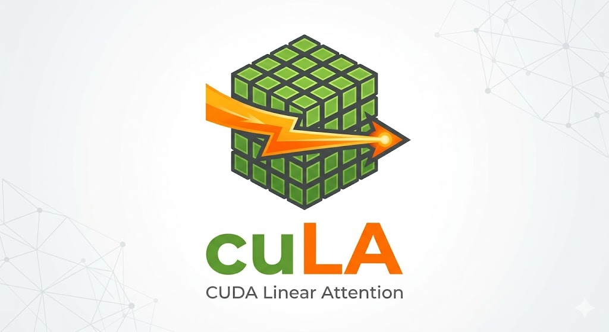

<div align="center">



# cuLA — CUDA Linear Attention

**High-performance CUDA kernels for linear attention variants, written in [CuTe DSL](https://github.com/NVIDIA/cutlass/tree/main/python/CuTeDSL) and CUTLASS C++.**

</div>

## Introduction

Linear attention mechanisms reformulate standard attention to use linear-time state updates instead of quadratic pairwise interactions, making them well suited for long-context LLM workloads. Recent variants such as [GLA](https://arxiv.org/abs/2312.06635), [KDA](http://arxiv.org/abs/2510.26692), [GDN](https://arxiv.org/abs/2412.06464), and [Lightning Attention](https://arxiv.org/abs/2405.17381) further improve expressiveness with gating, delta-style updates, and chunkwise decomposition.

**cuLA** provides hand-tuned CUDA implementations of these linear attention variants, targeting NVIDIA Blackwell (SM10X) and Hopper (SM90) GPUs. It is designed as a submodule of [flash-linear-attention (FLA)](https://github.com/fla-org/flash-linear-attention), sharing the same interface — adopting cuLA requires only a one-line import change. For ease of maintenance, cuLA is currently developed as a standalone library; the end goal is for users to seamlessly access these kernels through FLA. Since FLA already has a kernel dispatch mechanism in place, integration will be ready soon.

> **⚠️ Early Stage:** cuLA is in its early development phase. Many kernels still have significant room for optimization, and the API may evolve. We warmly welcome contributions from the community — whether it's performance tuning, new algorithm support, bug fixes, or architectural improvements. Every contribution helps push the boundaries of linear attention on modern GPUs!

## Installation

cuLA supports both **Hopper (SM90)** and **Blackwell (SM10X)** GPUs.

> **Requirements (Hopper & Blackwell):** Python 3.12+, CUDA Toolkit 12.9+ (SM10X support), NVCC 12.9+, PyTorch 2.9.1+

> **Note:** The PyTorch CUDA version must match your system CUDA Toolkit version. Check with `nvcc --version` and `python -c "import torch; print(torch.version.cuda)"`.

**Clone cuLA & dependencies:**

```bash
git clone https://github.com/inclusionAI/cuLA.git
git submodule update --init --recursive
```

**Install PyTorch:**

```bash
pip install torch==2.9.1 --index-url https://download.pytorch.org/whl/cu129
```

**Install cuLA & dependencies:**

```bash
# Install flash-linear-attention for benchmark repro
pip install -e third_party/flash-linear-attention

# Install cuLA
pip install -e . --no-build-isolation
```

## Quick Start

### KDA (Kimi Delta Attention) — Blackwell (SM10X)

Just change the import:

```python
import torch
from cula.kda import chunk_kda  # <-- one-line change from fla.ops.kda

B, T, H, K, V = 2, 2048, 32, 128, 128
device = 'cuda'

q = torch.randn(B, T, H, K, device=device, dtype=torch.bfloat16, requires_grad=True)
k = torch.randn(B, T, H, K, device=device, dtype=torch.bfloat16, requires_grad=True)
v = torch.randn(B, T, H, V, device=device, dtype=torch.bfloat16, requires_grad=True)
g = torch.randn(B, T, H, K, device=device, dtype=torch.bfloat16) * 0.1   # gate (log space)
beta = torch.randn(B, T, H, device=device, dtype=torch.bfloat16).sigmoid()
A_log = torch.randn(H, device=device, dtype=torch.float32) * 0.01
dt_bias = torch.zeros(H * K, device=device, dtype=torch.float32)
init_state = torch.zeros(B, H, K, V, device=device, dtype=torch.float32)

# Forward
o, final_state = chunk_kda(
    q=q, k=k, v=v, g=g, beta=beta,
    A_log=A_log,
    dt_bias=dt_bias,
    initial_state=init_state,
    output_final_state=True,
    use_qk_l2norm_in_kernel=True,
    use_gate_in_kernel=True,
    safe_gate=True,
    lower_bound=-5.0,
)

# Backward
do = torch.randn_like(o)
o.backward(do)

print(f'Output shape: {o.shape}')             # [2, 2048, 32, 128]
print(f'Final state shape: {final_state.shape}')  # [2, 32, 128, 128]
```

**Notes:**
- `safe_gate=True` is required to leverage TensorCore acceleration.
- `beta` supports both `float32` and `bfloat16`; `initial_state` must be `float32`.
- `cu_seqlens` (for variable-length sequences) must be `int32`.

## Usage

See [USAGE.md](USAGE.md) for detailed usage examples and notes.

## Benchmarks

Benchmarks run on a single **NVIDIA GB300/GB200/H200** GPU with **CUDA Toolkit 12.9**, **PyTorch 2.9.1**, **Triton 3.5.1**.

FLA baseline: [flash-linear-attention v0.4.2](https://github.com/fla-org/flash-linear-attention/releases/tag/v0.4.2).

**Blackwell (SM10X)**

See [BENCHMARK_GB300.md](BENCHMARK_GB300.md) for detailed results.

See [BENCHMARK_GB200.md](BENCHMARK_GB200.md) for detailed results.
 
**Hopper (SM90)**

See [BENCHMARK_H200.md](BENCHMARK_H200.md) for detailed results.

**Highlights:**
- **KDA Modular Forward (Blackwell):** **avg 1.45x** speedup on fixed-length, **avg 1.32x** on variable-length (18 configs, uniform/skewed/random).
- **Lightning Attention Prefill (Blackwell):** up to **1.86x** speedup (B=2).
- **Lightning Attention Varlen (Blackwell):** **avg 1.54x** speedup across 126 configs (uniform/skewed/random).
- **KDA Fused Forward (Hopper):** **avg 1.52x** speedup across fixed-length and variable-length sequences.

To regenerate benchmarks:

```bash
# Blackwell (SM10X)
python benchmarks/generate_benchmark_md.py

# Hopper (SM90)
python benchmarks/generate_benchmark_hopper_md.py
```

## Tests

```bash
# Tests for modular KDA forward against FLA Triton implementation
python -m pytest tests/test_kda_compare_fla.py -v
# Tests for modular KDA forward against naive KDA reference
python -m pytest tests/test_kda.py -v
# Tests for KDA fused forward
python -m pytest tests/test_kda_fused_fwd.py -v
# Tests for Lightning Attention fused forward
python tests/test_lightning_attn.py
# Tests for Lightning Attention decode
python -m pytest tests/test_la_decode.py -v
```

<details>
<summary>Sample test output</summary>

```
tests/test_kda_e2e_compare_fla.py::test_safe_gate_chunk[B1-T63-H1-D128-...]    PASSED
tests/test_kda_e2e_compare_fla.py::test_safe_gate_chunk[B2-T500-H3-D128-...]   PASSED
tests/test_kda_e2e_compare_fla.py::test_safe_gate_chunk[B2-T1000-H3-D128-...]  PASSED
tests/test_kda_e2e_compare_fla.py::test_safe_gate_chunk[B3-T1024-H4-D128-...]  PASSED
tests/test_kda_e2e_compare_fla.py::test_safe_gate_chunk[B4-T1024-H4-D128-...]  PASSED
tests/test_kda_e2e_compare_fla.py::test_safe_gate_chunk[B4-T2048-H8-D128-...]  PASSED
tests/test_kda_e2e_compare_fla.py::test_safe_gate_chunk_varlen[...]             PASSED
...
======================= 17 passed in 40.95s =======================
```

</details>

CUDA kernel tuning is significantly more labor-intensive than Triton — contributions from the open-source community are warmly welcomed!

## Repository Layout

See [REPO_LAYOUT.md](REPO_LAYOUT.md) for the full directory structure and a summary of each component.

## Roadmap

* [ ] Integrate into [flash-linear-attention](https://github.com/fla-org/flash-linear-attention) via FLA's kernel dispatch mechanism
* [ ] Polynomial approximation to mitigate the exponential bottleneck, as in [Flash-Attentiton-4](https://arxiv.org/abs/2603.05451).
* [ ] Larger chunk size and 2-CTA on SM10X for improved throughput.
* [ ] Continuous optimization via agentic methods such as [AVO](https://arxiv.org/abs/2603.24517).
* [ ] Support for more algorithms.
* [ ] Small B/H/S optimizations.
* [x] Support for BF16 beta input.

**Train**

* [x] Modular KDA Forward (SM10X, compatible with [Kimi CP](https://github.com/fla-org/flash-linear-attention/blob/main/fla/ops/cp/README.md))
  * [x] kda chunk intra
  * [x] chunk gated delta h
  * [ ] recompute wu
  * [x] chunk fwd o

* [ ] Modular GDN Forward / Backward Kernels (compatible with [Kimi CP](https://github.com/fla-org/flash-linear-attention/blob/main/fla/ops/cp/README.md))

* [ ] Backward pass optimizations.

* [ ] Kernel-level compute-communication overlapping for CP linear attention kernels (via **nvshmem**)

**Inference**

* [x] Lightning prefill kernel (SM10X)

* [x] Lightning decode kernel (SM90 & SM10X)

* [x] Fused KDA prefill kernel (SM90)

* [ ] Fused KDA prefill kernel (SM10X)

* [ ] MTP support

* [ ] More aggressive fusion of small neighboring kernels like cumsum for inference scenarios.

## Acknowledgements

This project is inspired by [flash-linear-attention](https://github.com/fla-org/flash-linear-attention), [CUTLASS](https://github.com/NVIDIA/cutlass), [CuTe DSL](https://github.com/NVIDIA/cutlass/tree/main/python/CuTeDSL), [FlashInfer](https://github.com/flashinfer-ai/flashinfer), [Flash-Attention](https://github.com/dao-ailab/flash-attention), and [FlashMLA](https://github.com/deepseek-ai/FlashMLA). We thank [FLA-org](https://github.com/fla-org) and NVIDIA for their great work.

## Citation

If you find cuLA useful, please cite it using the metadata in our [`CITATION.cff`](CITATION.cff) file:

```bibtex
@software{cula2026,
  title   = {cuLA: CUDA Linear Attention},
  author  = {Chaofan Yu, Bowen Zeng, Hao Chen, Zhe Yang, Zhiqiang Zhang, Huan Li and Jun Zhou},
  year    = {2026},
  url     = {https://github.com/InclusionAI/cuLA}
}
```

## Contact

If you're interested in an internship or job opportunity, feel free to reach out:  **chaofanyu@gmail.com**

No CUDA experience is required as long as you're a quick learner.

For Q&A and discussion, you can join us through:

- **Slack:** [cuLA Slack Community](https://join.slack.com/t/cula-hq/shared_invite/zt-3uaacvm9y-xJwZyGueeKxZRYQlj7~hxw)
- **WeChat:** [Click here to view the QR code](docs/cuLA-wechat.JPG)